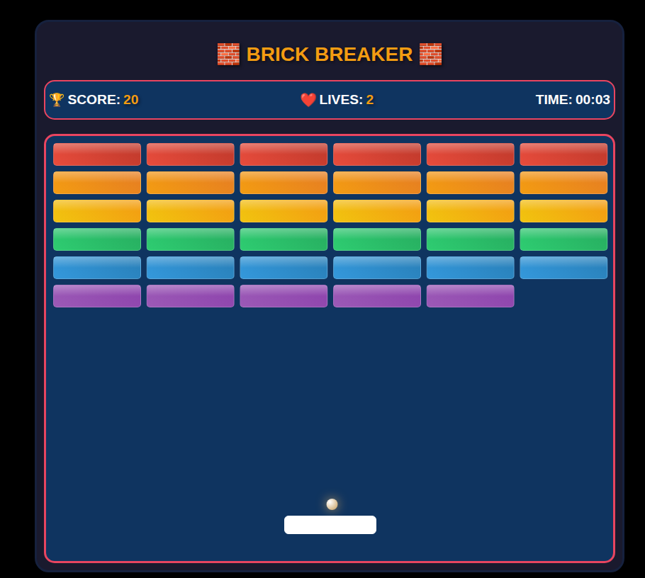

# 🎮 Brick Bricker Game

Welcome to **Brick Bricker** — a classic arcade-style game made with HTML, CSS, and JavaScript.

## 🧱 How to Play

- Move your paddle using your mouse or keyboard.
- Keep the ball from falling.
- Break all the bricks to win!

---

## 📁 Project Structure

```
make-your-game/
│
├── models/
│   ├── ball.js         // كلاس الكرة: الحجم، السرعة، الحركة، التصادم
│   ├── config.js       // إعدادات اللعبة (الأبعاد، السرعة، الألوان...)
│   ├── gameStatus.js   // التحكم في حالة اللعبة (تشغيل، توقف، خسارة...)
│   ├── helpers.js      // دوال مساعدة (مثلاً حساب التصادم)
│   └── paddle.js       // كلاس paddle: التحكم في الحركة و التصادم
│
├── html.html           // واجهة HTML الرئيسية
├── script.js           // السكريبت الرئيسي لي كيربط العناصر ويدير منطق اللعبة
├── style.css           // تنسيقات CSS لتجميل الواجهة
└── README.md           // هاد الملف: شرح المشروع
```

---

## 🚀 How to Run

1. Clone or download the project.  
```
git clone https://github.com/AhmedBaid/Full-Ecommerce-App
```
2. Open `html.html` in your browser.
3. Start playing!

---

## ⚙️ Technologies Used

- HTML5
- CSS3
- JavaScript (Vanilla)

---

## 📸 Screenshot

 

---

## 💡 Authors

- [Reda Anniz](https://github.com/redaaz07)
- [Marouane En-naas](https://github.com/Marouane-EN)
- [Ahmed Baid](https://github.com/AhmedBaid)
---

## 📜 License

This game is open-source and free to use for learning purposes.
